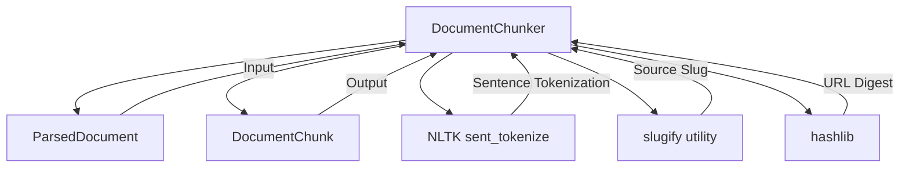

# Chunker Service Documentation

## Technology Stack Overview
- **Language**: Python 3.10+
- **Core Libraries**:
  - `nltk` for sentence tokenization
  - `hashlib` for deterministic ID generation
  - `enum` for strategy management
- **Architecture**: Strategy pattern for multiple chunking approaches
- **Deployment**: Python package within DataEngineeringCopilot project

## Key Components
- **DocumentChunker**: Main chunker class with multiple strategies
- **ChunkingStrategy**: Enum for supported chunking strategies
- **DocumentChunk**: Output data model
- **ParsedDocument**: Input data model

## Service Interactions

## Chunking Strategies

### 1. FIXED_SIZE (Legacy)
- **Description**: Word-based fixed-size chunking
- **Behavior**: Splits text into fixed word chunks regardless of sentence boundaries
- **Use Case**: Backward compatibility, simple chunking

### 2. SENTENCE_PRESERVING (Default)
- **Description**: Sentence-boundary aware chunking
- **Behavior**: 
  1. Splits text into sentences using NLTK
  2. Groups sentences into chunks respecting target word size
  3. Preserves paragraph boundaries when possible
  4. Applies min/max chunk size constraints
  5. Validates chunk quality before inclusion
- **Use Case**: Better semantic coherence, improved retrieval quality

## Configuration Parameters
- `chunk_size_words`: Target chunk size in words (default: 420)
- `overlap_words`: Overlap between chunks in words (default: 80)
- `strategy`: Chunking strategy (default: SENTENCE_PRESERVING)
- `min_chunk_words`: Minimum chunk size to avoid empty/tiny chunks (default: 10)

## Best Practices
- **Strategy Selection**: Use SENTENCE_PRESERVING for better quality
- **Validation**: Always validate chunk quality before inclusion
- **Deterministic IDs**: Maintain consistent chunk ID generation
- **Fallback**: Preserve fallback to fixed-size when NLTK fails
- **Logging**: Keep detailed logging for debugging

## Change Impact Considerations
- **Breaking Changes**: Modifications to chunking logic may affect:
  - Ingestion service chunk output
  - Vector store document structure
  - Retrieval quality and relevance
- **Backward Compatibility**:
  - Chunk ID format must remain consistent
  - DocumentChunk structure should not change
  - Strategy enum values should be preserved
- **Testing Impact**:
  - Chunker tests may require updates
  - Integration tests with ingestion may be affected

## Key Methods
- `chunk()`: Main chunking entry point
- `_chunk_fixed_size()`: Legacy fixed-size chunking
- `_chunk_sentence_preserving()`: Sentence-boundary aware chunking
- `_is_valid_chunk()`: Quality validation
- `_chunk_id()`: Deterministic ID generation

## Dependencies
- Domain Models: `domain/models.py`
- Utilities: `utils/text.py`
- External: `nltk` for sentence tokenization

## Notes for Developers
- Preserve existing validation logic
- Maintain deterministic chunk ID format
- Keep NLTK fallback for robustness
- Strategy pattern allows easy extension
- Configuration parameters should preserve defaults
- Logging provides valuable debugging information