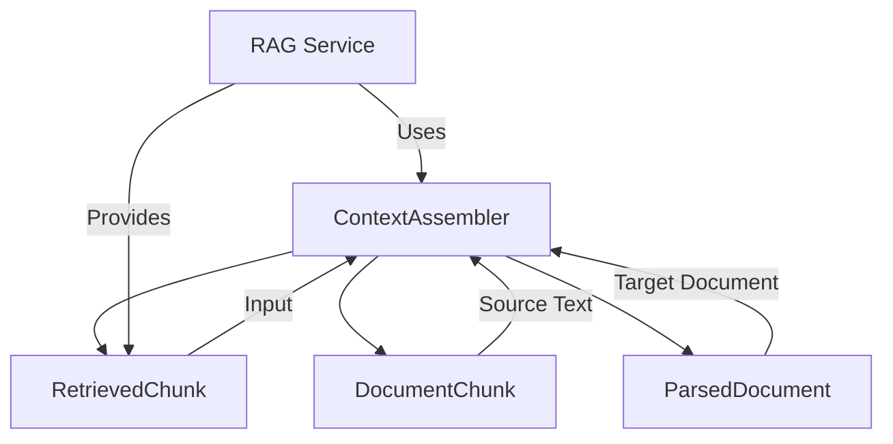

# Context Assembler Service Documentation

## Technology Stack Overview
- **Language**: Python 3.10+
- **Core Libraries**:
  - Standard Python modules (`logging`, `typing`, `List`)
- **Architecture**: Intelligent context assembly for LLM prompting
- **Deployment**: Python package within DataEngineeringCopilot project

## Key Components
- **ContextAssembler**: Main class for context construction
- **RetrievedChunk**: Input data model (retrieved chunks)
- **RetrievedChunk.chunk**: Nested DocumentChunk with source_name and text

## Service Interactions

## Workflow Process
1. **Deduplication**: Remove semantically similar chunks
2. **Context Building**: Format chunks with source attribution
3. **Truncation**: Respect max_context_chars limit
4. **Source Tracking**: Maintain list of source names
5. **Logging**: Track assembly statistics

## Deduplication Algorithm
- **Overlap Detection**: Uses word overlap ratio
- **Threshold**: 70% overlap considered duplicate
- **Selection**: Keeps highest confidence version
- **Filler Words**: Removes common stop words (the, a, an, and, or, in, on, at, to, of, is, are) to avoid false positives

## Configuration Parameters
- `max_context_chars`: Maximum characters allowed in final context (default: 2200)

## Best Practices
- **Deduplication**: Always deduplicate before context building
- **Source Attribution**: Include source name in formatted chunks
- **Truncation**: Respect context size limits
- **Chunk Ordering**: Process chunks already sorted by confidence
- **Logging**: Track deduplication and truncation statistics

## Change Impact Considerations
- **Breaking Changes**: Modifications to context assembly may affect:
  - Prompt quality and LLM responses
  - Source attribution in answers
  - Context length management
- **Backward Compatibility**:
  - Format string should remain consistent
  - Deduplication threshold should be preserved
  - Returned structure should not change
- **Testing Impact**:
  - Context assembler tests may require updates
  - Integration tests with RAG may be affected

## Key Methods
- `assemble()`: Main context assembly entry point
- `_deduplicate_chunks()`: Remove similar chunks
- `_text_overlap_ratio()`: Compute overlap between texts
- `__init__()`: Initialize with max_context_chars

## Dependencies
- Domain Models: `domain/models.py`
- Services: `services/rag.py` (for integration)

## Notes for Developers
- Preserve existing deduplication logic
- Maintain overlap threshold (70%)
- Keep source attribution format consistent
- Respect max_context_chars configuration
- Logging provides valuable debugging information