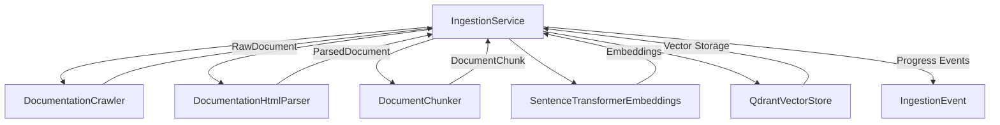

# Ingestion Service Documentation

## Technology Stack Overview
- **Language**: Python 3.10+
- **Core Libraries**: 
  - `urllib.request` for HTTP operations
  - `BeautifulSoup` for HTML parsing
  - `QdrantDB` for vector storage
  - `Ollama` for embeddings
- **Architecture**: Layered service following SOLID principles
- **Deployment**: Python package within DataEngineeringCopilot project

## Key Components
- **IngestionService**: Main service class handling ingestion workflow
- **DocumentationCrawler**: Crawls documentation sources
- **DocumentationHtmlParser**: Parses HTML content
- **DocumentChunker**: Splits documents into chunks
- **SentenceTransformerEmbeddings**: Generates embeddings
- **QdrantVectorStore**: Stores embeddings in vector database

## Service Interactions

## Workflow Process
1. **Source Selection**: Filters configured sources by name
2. **Crawling**: Downloads HTML pages from selected sources
3. **Parsing**: Extracts readable content from HTML
4. **Chunking**: Splits parsed documents into manageable chunks
5. **Embedding**: Generates vector embeddings for chunks
6. **Storage**: Upserts embeddings to Qdrant vector store
7. **Event Emission**: Reports progress through IngestionEvent

## Configuration Parameters
- `max_pages_per_source`: Maximum pages to crawl per source
- `chunk_size_words`: Number of words per chunk
- `chunk_overlap_words`: Overlap between chunks
- `ingestion_batch_chunk_size`: Batch size for vector operations
- `sources`: Configured documentation sources

## Best Practices
- **Minimal Changes**: Only modify ingestion workflow when necessary
- **Error Handling**: Preserve existing error handling patterns
- **Event System**: Maintain existing IngestionEvent structure
- **Batch Processing**: Keep batch chunking logic intact
- **Source Validation**: Maintain strict source name matching

## Change Impact Considerations
- **Breaking Changes**: Modifications to core ingestion workflow may affect:
  - CLI command behavior (`python main.py ingest`)
  - UI ingestion functionality
  - Progress tracking and logging
- **Backward Compatibility**: 
  - Source selection must maintain exact name matching
  - Event structure should remain consistent
  - Configuration parameters should preserve defaults
- **Testing Impact**: 
  - Ingestion-related tests may require updates
  - Integration tests with vector store may be affected

## Key Methods
- `ingest()`: Main ingestion entry point
- `_selected_sources()`: Source filtering and validation
- `_emit()`: Event emission system
- `_flush_batch()`: Batch processing for vector operations

## Dependencies
- Configuration: `config/settings.py`
- Domain Models: `domain/models.py`
- Infrastructure: 
  - `infrastructure/crawler.py`
  - `infrastructure/html_parser.py`
  - `infrastructure/embeddings.py`
  - `infrastructure/vector_store.py`
  - `services/chunker.py`

## Notes for Developers
- Preserve existing error handling patterns
- Maintain exact source name matching for configuration
- Keep batch processing logic intact
- Event structure should remain consistent
- Configuration parameters should preserve defaults
</response>
<needs_more_exploration>false</needs_more_exploration>
<task_progress>
- [x] Plan documentation structure for all services
- [x] Identify first service to document (ingestion)
- [ ] Gather configuration details from settings.py and documentation_sources.json
- [ ] Create template for service documentation
- [x] Create documentation for ingestion service
- [ ] Create documentation for next service (RAG)
</task_progress>
</write_to_file>