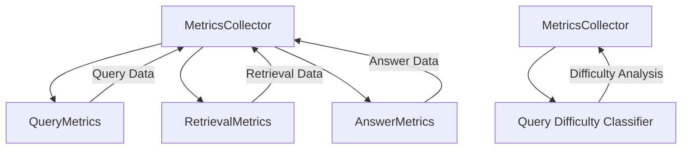

# Metrics Service Documentation

## Technology Stack Overview
- **Language**: Python 3.10+
- **Core Libraries**:
  - `dataclasses` for structured data modeling
  - `logging` for metric tracking
  - Standard Python modules (`datetime`, `typing`)
- **Architecture**: Metrics tracking and analysis framework
- **Deployment**: Python package within DataEngineeringCopilot project

## Key Components
### 1. **RetrievalMetrics**
Tracks retrieval quality metrics:
- **MRR (Mean Reciprocal Rank)**: Average of reciprocal ranks of first relevant document
- **Precision@k**: Proportion of relevant documents in top-k results
- **Top Confidence**: Confidence score of the most relevant retrieved chunk

### 2. **AnswerMetrics**
Evaluates answer quality:
- **Answer Length**: Number of words in the generated answer
- **Key Sections Detection**: Presence of structured sections (e.g., "Answer:", "Key Points:")
- **Uncertainty Markers**: Detection of phrases indicating uncertainty
- **Source Count**: Number of sources cited in the answer

### 3. **QueryMetrics**
Comprehensive query analysis:
- **Query Difficulty Classification**: Easy/Medium/Hard based on characteristics
- **Timestamp**: When the query was processed
- **Confidence Score**: Overall confidence in the answer
- **Answer Status**: Whether the query was successfully answered

### 4. **MetricsCollector**
Central metrics management:
- Maintains history of all queries
- Classifies query difficulty
- Aggregates metrics for analysis

## Service Interactions

## Workflow Process
1. **Query Processing**: Create QueryMetrics instance for each query
2. **Difficulty Classification**: Analyze query characteristics
3. **Retrieval Tracking**: Record RetrievalMetrics after vector store query
4. **Answer Generation**: Track AnswerMetrics during response generation
5. **Aggregation**: Store all metrics in MetricsCollector for analysis

## Configuration Parameters
- **Difficulty Thresholds**: Criteria for easy/medium/hard classification
- **Metric Collection Frequency**: How often metrics are persisted
- **Threshold Alerts**: Confidence score thresholds for low-quality answers

## Best Practices
- **Consistent Collection**: Ensure metrics are collected for all queries
- **Validation**: Verify answer structure before metric calculation
- **Threshold Monitoring**: Track confidence score distributions
- **Difficulty Analysis**: Use difficulty classification for system improvements
- **Data Retention**: Maintain metrics history for trend analysis

## Change Impact Considerations
- **Breaking Changes**: Modifications to metric calculation may affect:
  - System performance evaluation
  - Quality assurance processes
  - User experience analysis
- **Backward Compatibility**:
  - Metric structure should remain consistent
  - Difficulty classification criteria should be preserved
  - Data format for historical metrics should not change
- **Testing Impact**:
  - Metrics tests may require updates
  - Integration tests with RAG pipeline may be affected

## Key Methods
- `classify_query_difficulty()`: Determines query difficulty level
- `MetricsCollector.add_query()`: Records query metrics
- `MetricsCollector.get_stats()`: Retrieves aggregated metrics
- `RetrievalMetrics.calculate()`: Computes retrieval quality metrics

## Dependencies
- Domain Models: `domain/models.py`
- Services: `services/rag.py` (for answer generation context)
- Utilities: `utils/text.py` (for answer analysis)

## Notes for Developers
- Maintain consistent metric calculation logic
- Preserve difficulty classification thresholds
- Ensure metrics are collected for all queries
- Keep data formats consistent for historical analysis
- Logging should capture metric calculation details