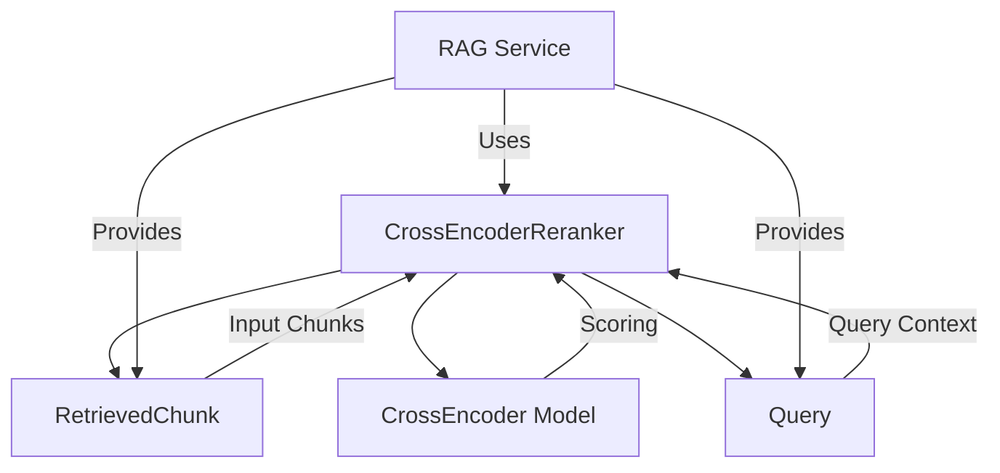

# Reranker Service Documentation

## Technology Stack Overview
- **Language**: Python 3.10+
- **Core Libraries**:
  - `sentence-transformers` for cross-encoder models
  - `logging` for operation tracking
  - Standard Python modules (`typing`, `List`)
- **Architecture**: Cross-encoder reranking for improved retrieval
- **Deployment**: Python package within DataEngineeringCopilot project

## Key Components
- **CrossEncoderReranker**: Main reranking class using cross-encoder models
- **RetrievedChunk**: Input data model (chunks to be reranked)
- **sentence-transformers**: HuggingFace cross-encoder implementation

## Service Interactions

## Workflow Process
1. **Model Initialization**: Load cross-encoder model (if available)
2. **Input Validation**: Check for empty chunks or unavailable model
3. **Text Preparation**: Create (query, chunk_text) pairs
4. **Cross-Encoder Scoring**: Score each pair using cross-encoder
5. **Sorting**: Sort chunks by cross-encoder score (highest first)
6. **Top-k Selection**: Return top_k results
7. **Logging**: Track performance and score improvements

## Configuration Parameters
- `model_name`: HuggingFace model identifier (default: "cross-encoder/qnli-distilroberta-base")
- `top_k`: Number of top results to return after reranking
- `reranker_enabled`: Enable/disable reranking in settings
- `reranker_model`: Model name from settings
- `reranker_top_k`: Top-k after reranking from settings

## Best Practices
- **Model Availability**: Gracefully handle missing sentence-transformers
- **Performance**: Only rerank when beneficial (more chunks than top_k)
- **Logging**: Track score improvements and performance
- **Fallback**: Return original chunks if reranking fails
- **Efficiency**: Avoid reranking when not needed

## Change Impact Considerations
- **Breaking Changes**: Modifications to reranking logic may affect:
  - Retrieval quality and relevance
  - Answer generation performance
  - System response times
- **Backward Compatibility**:
  - Model interface should remain consistent
  - Chunk structure should not change
  - Scoring format should be preserved
- **Testing Impact**:
  - Reranker tests may require updates
  - Integration tests with RAG pipeline may be affected

## Key Methods
- `__init__()`: Initialize cross-encoder model
- `rerank()`: Main reranking entry point
- `is_available()`: Check if model is loaded and ready
- `_prepare_pairs()`: Internal method for text pair preparation

## Dependencies
- Domain Models: `domain/models.py`
- External: `sentence-transformers` (optional dependency)
- Services: `services/rag.py` (for integration)

## Notes for Developers
- Preserve existing error handling patterns
- Maintain graceful degradation when model unavailable
- Keep performance optimizations intact
- Logging provides valuable debugging information
- Configuration parameters should preserve defaults