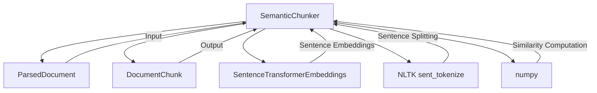

# Semantic Chunker Service Documentation

## Technology Stack Overview
- **Language**: Python 3.10+
- **Core Libraries**:
  - `numpy` for numerical operations
  - `nltk` for sentence tokenization
  - `hashlib` for deterministic ID generation
  - `sentence-transformers` for embeddings (via SentenceTransformerEmbeddings)
- **Architecture**: Semantic clustering-based chunking
- **Deployment**: Python package within DataEngineeringCopilot project

## Key Components
- **SemanticChunker**: Main chunker class using semantic similarity clustering
- **SentenceTransformerEmbeddings**: Embedding model for sentence encoding
- **ParsedDocument**: Input data model
- **DocumentChunk**: Output data model

## Service Interactions

## Workflow Process
1. **Sentence Tokenization**: Split document into sentences using NLTK
2. **Embedding Generation**: Generate embeddings for each sentence
3. **Semantic Clustering**: Group sentences by cosine similarity
4. **Cluster Merging**: Merge clusters into chunks respecting size constraints
5. **Validation**: Validate chunk quality before inclusion
6. **ID Generation**: Create deterministic chunk IDs

## Configuration Parameters
- `chunk_size_words`: Target chunk size in words (default: 420)
- `overlap_words`: Overlap between chunks in words (default: 80)
- `embedding_model`: SentenceTransformerEmbeddings instance
- `min_semantic_similarity`: Minimum cosine similarity for grouping (default: 0.5)
- `min_chunk_words`: Minimum chunk size (default: 20)
- `max_chunk_words`: Maximum chunk size (default: chunk_size_words * 1.5)

## Clustering Algorithm
1. Start with first sentence in its own cluster
2. For each subsequent sentence:
   - Compute similarity to all existing cluster centers
   - If max similarity >= min_semantic_similarity, add to most similar cluster
   - Otherwise, create new cluster
3. Use cluster center (mean of embeddings) for similarity computation

## Best Practices
- **Semantic Coherence**: Preserves topical coherence within chunks
- **Quality Validation**: Always validate chunk quality before inclusion
- **Fallback Handling**: Handle embedding failures gracefully
- **Deterministic IDs**: Maintain consistent chunk ID generation
- **Logging**: Track clustering and merging statistics

## Change Impact Considerations
- **Breaking Changes**: Modifications to semantic clustering may affect:
  - Chunk quality and coherence
  - Retrieval performance
  - Answer generation quality
- **Backward Compatibility**:
  - Chunk ID format should remain consistent
  - DocumentChunk structure should not change
  - Configuration parameters should preserve defaults
- **Testing Impact**:
  - Semantic chunker tests may require updates
  - Integration tests with embeddings may be affected

## Key Methods
- `chunk()`: Main chunking entry point
- `_cluster_sentences()`: Group sentences by semantic similarity
- `_merge_clusters_into_chunks()`: Create chunks from clusters
- `_is_valid_chunk()`: Quality validation
- `_chunk_id()`: Deterministic ID generation

## Dependencies
- Domain Models: `domain/models.py`
- Infrastructure: `infrastructure/embeddings.py`
- Utilities: `utils/text.py`
- External: `numpy`, `nltk`

## Notes for Developers
- Preserve existing clustering algorithm logic
- Maintain semantic similarity threshold
- Keep fallback handling for embedding failures
- Deterministic chunk IDs are critical for consistency
- Configuration parameters should preserve defaults
- Logging provides valuable debugging information